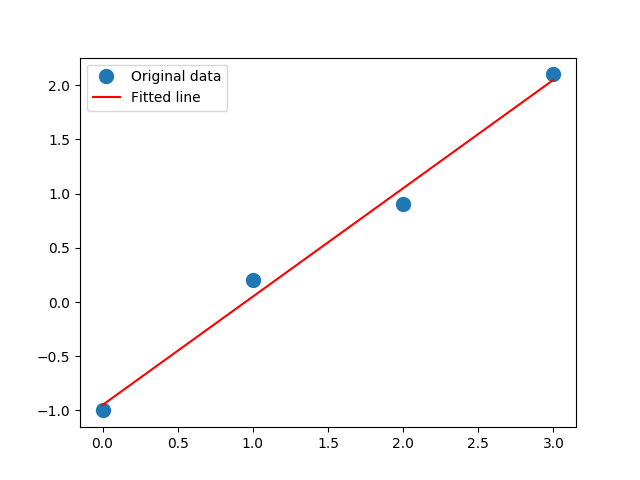

```{r, echo=FALSE}
knitr::opts_chunk$set(
  comment=NA,
  engine.path = list(
    python = '/usr/local/bin/python3'
  )
)
```

https://machinelearningmastery.com/linear-algebra-cheat-sheet-for-machine-learning/

by Jason Brownlee on February 23, 2018 in Linear Algebra

*All of the Linear Algebra Operations that You Need to Use in NumPy for Machine Learning*

The Python numerical computation library called NumPy provides many linear algebra functions that may be useful as a machine learning practitioner.

In this tutorial, you will discover the key functions for working with vectors and matrices that you may find useful as a machine learning practitioner.

This is a cheat sheet and all examples are short and assume you are familiar with the operation being performed.

You may want to bookmark this page for future reference.

## Overview

This tutorial is divided into 7 parts:

1. Arrays

2. Vectors

3. Matrices

4. Types of Matrices

5. Matrix Operations

6. Matrix Factorization

7. Statistics

## 1. Arrays

There are many ways to create NumPy arrays.

### Array

*Python code*

```{python}
from numpy import array

A = array([[1, 2, 3], [1, 2, 3], [1, 2, 3]])
print(A)
```

*R code*

```{r}
A <- matrix(c(1, 2, 3, 1, 2, 3, 1, 2, 3), nrow = 3, byrow = TRUE)
A
```

### Empty

*Python code*

```{python}
from numpy import empty

A = empty([3, 3])
print(A)
```

*R code*

```{r}
A <- matrix(rep(NA, 9), nrow = 3, byrow = TRUE)
A
```

### Zeros

*Python code*

```{python}
from numpy import zeros

A = zeros([3, 5])
print(A)
```

*R code*

```{r}
A <- matrix(rep(0, 15), nrow = 3, byrow = TRUE)
A
```

### Ones

*Python code*

```{python}
from numpy import ones

A = ones([5, 5])
print(A)
```

*R code*

```{r}
A <- matrix(rep(1, 25), nrow = 5, byrow = TRUE)
A
```

## 2. Vectors

A vector is a list or column of scalars.

### Vector Addition

*Python code*

```{python}
import numpy

a = numpy.array([1, 2, 3])
b = numpy.array([4, 5, 6])

c = a + b
print(c)
```

*R code*

```{r}
a <- c(1, 2, 3)
b <- c(4, 5, 6)

c <- a + b
c
```

### Vector Subtraction

*Python code*

```{python}
import numpy

a = numpy.array([1, 2, 3])
b = numpy.array([4, 5, 6])

c = a - b
print(c)
```

*R code*

```{r}
c <- a - b
c
```

### Vector Multiplication

*Python code*

```{python}
import numpy

a = numpy.array([1, 2, 3])
b = numpy.array([4, 5, 6])

c = a * b
print(c)
```

*R code*

```{r}
c <- a * b
c
```

### Vector Division

*Python code*

```{python}
import numpy

a = numpy.array([1, 2, 3])
b = numpy.array([4, 5, 6])

c = a / b
print(c)
```

*R code*

```{r}
c <- a / b
c
```

### Vector Dot Product

*Python code*

```{python}
import numpy

a = numpy.array([1, 2, 3])
b = numpy.array([4, 5, 6])

c = a.dot(b)
print(c)
```

*R code*

```{r}
c <- a %*% b
c
```

### Vector-Scalar Multiplication

*Python code*

```{python}
import numpy

a = numpy.array([1, 2, 3])

c = a * 2.2
print(c)
```

*R code*

```{r}
c <- a * 2.2
c
```

### Vector Norm

*Python code*

```{python}
import numpy
from numpy.linalg import norm

v = numpy.array([1, 2, 3])

l2 = norm(v)
print(l2)
```

*R code*

```{r}
v <- c(1, 2, 3)

l2 <- norm(v, type = "2")
l2
```

## 3. Matrices

A matrix is a two-dimensional array of scalars.

### Matrix Addition

*Python code*

```{python}
import numpy

A = numpy.array([[1, 2, 3], [4, 5, 6], [7, 8, 9]])
B = numpy.array([[7, 8, 9], [4, 5, 6], [1, 2, 3]])

C = A + B
print(C)
```

*R code*

```{r}
A <- matrix(c(1, 2, 3, 4, 5, 6, 7, 8, 9), nrow = 3, byrow = TRUE)
B <- matrix(c(7, 8, 9, 4, 5, 6, 1, 2, 3), nrow = 3, byrow = TRUE)

C <- A + B
C
```

### Matrix Subtraction

*Python code*

```{python}
import numpy

A = numpy.array([[1, 2, 3], [4, 5, 6], [7, 8, 9]])
B = numpy.array([[7, 8, 9], [4, 5, 6], [1, 2, 3]])

C = A - B
print(C)
```

*R code*

```{r}
C <- A - B
C
```

### Matrix Multiplication (Hadamard Product)

*Python code*

```{python}
import numpy

A = numpy.array([[1, 2, 3], [4, 5, 6], [7, 8, 9]])
B = numpy.array([[7, 8, 9], [4, 5, 6], [1, 2, 3]])

C = A * B
print(C)
```

*R code*

```{r}
C <- A * B
C
```

### Matrix Division

*Python code*

```{python}
import numpy

A = numpy.array([[1, 2, 3], [4, 5, 6], [7, 8, 9]])
B = numpy.array([[7, 8, 9], [4, 5, 6], [1, 2, 3]])

C = A / B
print(C)
```

*R code*

```{r}
C <- A / B
C
```

### Matrix-Matrix Multiplication (Dot Product)

*Python code*

```{python}
import numpy

A = numpy.array([[1, 2, 3], [4, 5, 6], [7, 8, 9]])
B = numpy.array([[7, 8, 9], [4, 5, 6], [1, 2, 3]])

C = A.dot(B)
print(C)
```

*R code*

```{r}
C <- A %*% B
C
```

### Matrix-Vector Multiplication (Dot Product)

*Python code*

```{python}
import numpy

A = numpy.array([[1, 2, 3], [4, 5, 6], [7, 8, 9]])
b = numpy.array([7, 8, 9])

C = A.dot(b)
print(C)
```

*R code*

```{r}
b <- matrix(c(7, 8, 9), nrow = 3, byrow = TRUE)

C <- A %*% b
C
```

### Matrix-Scalar Multiplication

*Python code*

```{python}
import numpy

A = numpy.array([[1, 2, 3], [4, 5, 6], [7, 8, 9]])

C = A.dot(2.2)
print(C)
```

*R code*

```{r}
C <- A * 2.2
C
```

## 4. Types of Matrices

Different types of matrices are often used as elements in broader calculations.

### Triangle Matrix

#### lower

*Python code*

```{python}
import numpy
from numpy import tril

M = numpy.array([[1, 2, 3], [4, 5, 6], [7, 8, 9]])

lower = tril(M)
print(lower)
```

*R code*

```{r}
M <- matrix(c(1, 2, 3, 4, 5, 6, 7, 8, 9), nrow = 3, byrow = TRUE)

lower <- lower.tri(M, diag = TRUE)*M
lower
```

#### upper

*Python code*

```{python}
import numpy
from numpy import triu

M = numpy.array([[1, 2, 3], [4, 5, 6], [7, 8, 9]])

upper = triu(M)
print(upper)
```

*R code*

```{r}
upper <- upper.tri(M, diag = TRUE)*M
upper
```

### Diagonal Matrix

*Python code*

```{python}
import numpy
from numpy import diag

M = numpy.array([[1, 2, 3], [4, 5, 6], [7, 8, 9]])

d = diag(M)
print(d)
```

*R code*

```{r}
d <- diag(M)
d
```

### Identity Matrix

*Python code*

```{python}
from numpy import identity

I = identity(3)
print(I)
```

*R code*

```{r}
Id <- diag(3)
Id
```

## 5. Matrix Operations

Matrix operations are often used as elements in broader calculations.

### Matrix Transpose

*Python code*

```{python}
import numpy

A = numpy.array([[1, 2, 3], [4, 5, 6], [7, 8, 9]])

B = A.T
print(B)
```

*R code*

```{r}
B <- t(A)
B
```

### Matrix Inversion

*Python code*

```{python}
import numpy
from numpy.linalg import inv

A = numpy.array([[1, 2, 3], [3, 2, 1], [2, 3, 1]])

B = inv(A)
print(B)
```

*R code*

```{r}
library(MASS)

A <- matrix(c(1, 2, 3, 3, 2, 1, 2, 3, 1), nrow = 3, byrow = TRUE)

B <- ginv(A)
B
```

### Matrix Trace

*Python code*

```{python}
import numpy
from numpy import trace

A = numpy.array([[1, 2, 3], [4, 5, 6], [7, 8, 9]])

B = trace(A)
print(B)
```

*R code*

```{r}
A <- matrix(c(1, 2, 3, 4, 5, 6, 7, 8, 9), nrow = 3, byrow = TRUE)

B <- sum(diag(A)) # only if matrix A is square (n x n) - otherwise use 'matrix.trace' in 'matrixcalc' package
B
```

### Matrix Determinant

*Python code*

```{python}
import numpy
from numpy.linalg import det

A = numpy.array([[1, 2, 3], [3, 2, 1], [2, 3, 1]])

B = det(A)
print(B)
```

*R code*

```{r}
A <- matrix(c(1, 2, 3, 3, 2, 1, 2, 3, 1), nrow = 3, byrow = TRUE)

B <- det(A)
B
```

### Matrix Rank

*Python code*

```{python}
import numpy
from numpy.linalg import matrix_rank

A = numpy.array([[1, 2, 3], [3, 2, 1], [2, 3, 1]])

r = matrix_rank(A)
print(r)
```

*R code*

```{r}
library(Matrix)

r <- rankMatrix(A)
r[1]
```

## 6. Matrix Factorization

Matrix factorization, or matrix decomposition, breaks a matrix down into its constituent parts to make other operations simpler and more numerically stable.

### LU Decomposition

*Python code*

```{python}
import numpy
from scipy.linalg import lu

A = numpy.array([[1, 2, 3], [3, 2, 1], [2, 3, 1]])

P, L, U = lu(A)
print(P)
print(L)
print(U)
```

*R code*

```{r}
LUP <- lu(A)
expand(LUP)
```

### QR Decomposition

*Python code*

```{python}
import numpy
from numpy.linalg import qr

A = numpy.array([[1, 2, 3], [3, 2, 1], [2, 3, 1]])

Q, R = qr(A, 'complete')
print(Q)
print(R)
```

*R code*

```{r}
QR <- qr(A)
qr.Q(QR)
qr.R(QR)
```

### Eigendecomposition

*Python code*

```{python}
import numpy
from numpy.linalg import eig

A = numpy.array([[1, 2, 3], [3, 2, 1], [2, 3, 1]])

values, vectors = eig(A)
print(values)
print(vectors)
```

*R code*

```{r}
eig <- eigen(A)
eig
```

### Singular-Value Decomposition

*Python code*

```{python}
import numpy
from scipy.linalg import svd

A = numpy.array([[1, 2, 3], [3, 2, 1], [2, 3, 1]])

U, s, V = svd(A)
print(U)
print(s)
print(V)
```

*R code*

```{r}
duv <- svd(A)
duv
```

## 7. Statistics

Statistics summarize the contents of vectors or matrices and are often used as components in broader operations.

### Mean

*Python code*

```{python}
import numpy
from numpy import mean

v = numpy.array([1, 2, 3, 3, 2, 1, 2, 3, 1])

result = mean(v)
print(result)
```

*R code*

```{r}
v <- c(1, 2, 3, 3, 2, 1, 2, 3, 1)
result <- mean(v)
result
```

### Variance

*Python code*

```{python}
import numpy
from numpy import var

v = numpy.array([1, 2, 3, 3, 2, 1, 2, 3, 1])

result = var(v, ddof = 1)
print(result)
```

*R code*

```{r}
result <- var(v)
result
```

### Standard Deviation

*Python code*

```{python}
import numpy
from numpy import std

v = numpy.array([1, 2, 3, 3, 2, 1, 2, 3, 1])

result = std(v, ddof = 1)
print(result)
```

*R code*

```{r}
result <- sd(v)
result
```

### Covariance Matrix

*Python code*

```{python}
import numpy
from numpy import cov

v1 = numpy.array([1, 2, 3, 3, 2, 1, 2, 3, 1])
v2 = numpy.array([1, 2, 0, 0, 2, 1, 2, 0, 1])

sigma = cov(v1, v2)
print(sigma)
```

*R code*

```{r}
v1 <- c(1, 2, 3, 3, 2, 1, 2, 3, 1)
v2 <- c(1, 2, 0, 0, 2, 1, 2, 0, 1)

sigma <- cov(cbind(v1, v2))
sigma
```

### Linear Least Squares

*Python code*

```{python}
#https://docs.scipy.org/doc/numpy/reference/generated/numpy.linalg.lstsq.html#numpy.linalg.lstsq
import numpy
from numpy.linalg import lstsq

x = numpy.array([0, 1, 2, 3])
y = numpy.array([-1, 0.2, 0.9, 2.1])

A = numpy.vstack([x, numpy.ones(len(x))]).T

m, c = lstsq(A, y)[0]
print(m, c)

import matplotlib.pyplot as plt
plt.plot(x, y, 'o', label = 'Original data', markersize = 10)
plt.plot(x, m*x + c, 'r', label = 'Fitted line')
plt.legend()
#plt.show()
plt.savefig("fig-lstsq.png")
```



*R code*

```{r}
x <- c( 0, 1  , 2  , 3  )
y <- c(-1, 0.2, 0.9, 2.1)

xy.lm <- lm(y ~ x)
coef(xy.lm)

par(pty = "s")
plot(x, y, col = "blue", pch = 16)
abline(xy.lm, col = "red")
```

## Further Reading

This section provides more resources on the topic if you are looking to go deeper.

### NumPy API

- [Linear algebra](https://docs.scipy.org/doc/numpy-1.13.0/reference/routines.linalg.html)

- [Statistics](https://docs.scipy.org/doc/numpy-1.13.0/reference/routines.statistics.html)

### Other Cheat Sheets

- [Python For Data Science Cheat Sheet, DataCamp (PDF)](https://s3.amazonaws.com/assets.datacamp.com/blog_assets/Python_SciPy_Cheat_Sheet_Linear_Algebra.pdf)

- [Linear algebra explained in four pages (PDF)](https://minireference.com/static/tutorials/linear_algebra_in_4_pages.pdf)

- [Linear Algebra Cheat Sheet](https://github.com/scalanlp/breeze/wiki/Linear-Algebra-Cheat-Sheet)

## Summary

In this tutorial, you discovered the key functions for linear algebra that you may find useful as a machine learning practitioner.

Are there other key linear algebra functions that you use or know of? Let me know in the comments below.

Do you have any questions? Ask your questions in the comments below and I will do my best to answer.
